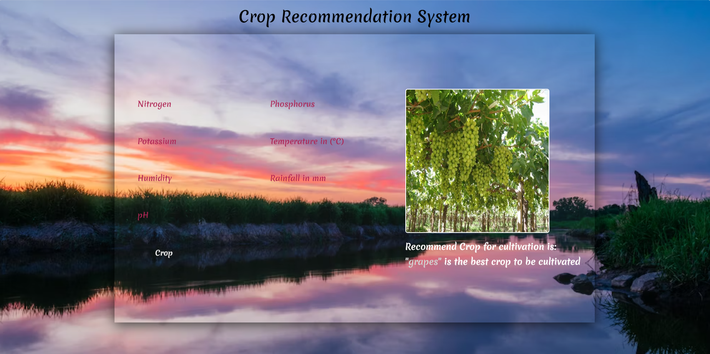

# Crop Recommendation System

A machine learning-powered system to recommend optimal crops for a given location and conditions.

## Table of Contents

- [Overview](#overview)
- [Features](#features)
- [Technologies Used](#technologies-used)
- [Installation](#installation)
- [Usage](#usage)
- [Dataset](#dataset)
- [User Interface](#user-interface)
- [Queries](#reach-out-for-queries)

## Overview

This project aims to provide farmers and agricultural professionals with accurate crop recommendations based on factors such as:

- Location: soil type(Nitrogen(N) ,Potassium(K) ,Phosphorous(P))
- Historical Crop Data: Past crop yields and performance
- Current Conditions: Weather, soil moisture, humidity

## Features

- **Machine Learning-Driven Recommendations:** Uses a trained model to predict suitable crops.
- **User-Friendly Interface:** Simplifies interaction and makes recommendations accessible.
- **Detailed Information:** Provides insights into recommended crops and their requirements.
- **Customizable:** Allows for adjustments to factors and weights for tailored recommendations.

## Technologies Used

- **Python:** For model development and backend logic.
- **Machine Learning Library:** scikit-learn
- **UI Framework:** Flask
- **Additional Libraries:** Numpy
- **Deployment:** Render

## Installation

1. **Clone this repository:**
   ```bash
   git clone https://github.com/lohith84/crop-recommendation.git

2. **Navigate to the project directory:**
   ```bash
   cd crop-recommendation

3. **Install dependencies:**
   ```bash
   pip install -r requirements.txt

## Usage

## How to Run the Application

1. Clone the repository: `git clone https://github.com/lohith84/crop-recommendation.git`
2. Navigate to the project directory: `cd crop-recommendation`
3. Install dependencies: `pip install -r requirements.txt`
4. Run the application: `python app.py`
5. Open your web browser and go to `http://localhost:5000` to access the application.

## Dataset

- **Source:** Kaggle Crop Recommendation Dataset
- **Link:** [[DataSet](https://www.kaggle.com/datasets/atharvaingle/crop-recommendation-dataset)]

## User Interface

### Screenshot



## Reach Out for Queries

If you have any questions, issues, feedback, or need assistance, feel free to reach out:

- **Email:** [lohith2086@gmail.com](mailto:lohith2086@gmail.com)
- **Contribute via Pull Request:** I welcome contributions! If you'd like to contribute to the development of this project or any issue regarding, please submit a pull request.

I appreciate your interest in my Crop Recommendation System and look forward to hearing from you!


